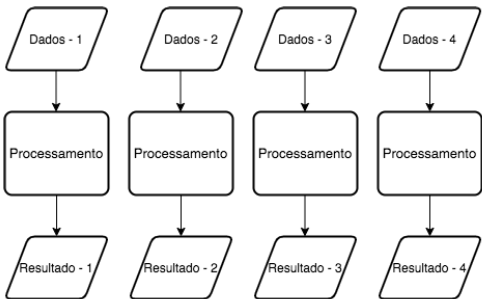
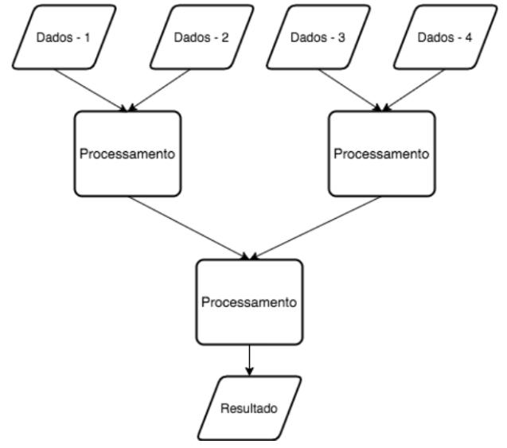

GEE, Big Data e Computação Paralela
===================================

O `Google Earth Engine (GEE)`_ é uma plataforma de análise geoespacial baseada
na nuvem, otimizada para o processamento de grandes conjuntos de dados.
Utilizando uma arquitetura avançada de *Big Data* e técnicas de computação
paralela, o GEE é capaz de realizar operações complexas em dados geoespaciais em
grande escala e alta velocidade.

.. _Google Earth Engine (GEE): https://earthengine.google.com/

Big Data
--------

O conceito de *Big Data* é caracterizado pelos três Vs:

- **Volumoso:** Grandes conjuntos de dados.
- **Variado:** Diversidade de tipos de dados.
- **Veloz:** Necessidade de processamento rápido.

O GEE emprega padrões de computação paralela, como "map" e "reduce", para
distribuir eficientemente as operações através de múltiplos processadores.

Padrões de Computação Paralela
------------------------------

Map
~~~

O padrão "Map" aplica uma operação a cada item em um conjunto de dados,
produzindo um novo conjunto de itens correspondentes, conforme ilustrado na
Figura 1.

   *Figura 1: Diagrama ilustrativo do padrão Map.
   Adaptado de* [GRIEBLER2011]_

Reduce
~~~~~~

O padrão "Reduce", por outro lado, sumariza ou agrega um conjunto de dados em um
único valor ou conjunto menor, como mostrado na Figura 2.

   *Figura 2: Representação esquemática do padrão Reduce.
   Adaptado de* [GRIEBLER2011]_

MapReduce
~~~~~~~~~

O modelo "MapReduce" combina os padrões "Map" e "Reduce". O conjunto de saídas
gerado pela fase "Map" serve como entrada para a fase "Reduce", permitindo
processamento eficiente e escalável em grandes volumes de dados.